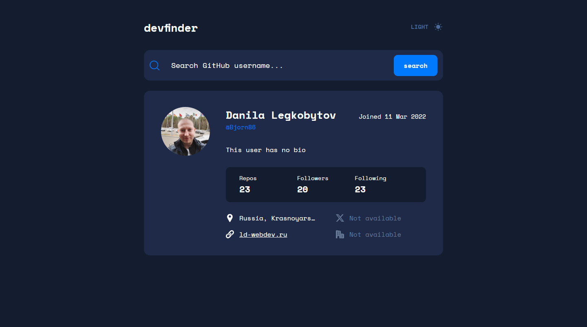

# Проект - Github Profiler

Проект представляет из себя одностраничное приложение показывающие информацию о пользователе GitHub. Информация о пользователях предоставляется с помощью [GitHub REST API](https://docs.github.com/en/rest?apiVersion=2022-11-28).

## Оглавление

- [Обзор проекта](#обзор-проекта)
  - [Задачи проекта](#задачи-проекта)
  - [Функциональность проекта](#функциональность-проекта)
  - [Screenshot](#screenshot)
  - [Директории проекта](#директории-проекта)
  - [Запуск проекта](#запуск-проекта)
  - [Ссылки](#ссылки)
- [Ход выполнения проекта](#ход-выполнения-проекта)
  - [Используемые технологии и методологии](#используемые-технологии-и-методологии)
  - [Чему я научился работая над проектом](#чему-я-научился-работая-над-проектом)
- [Автор](#автор)

## Обзор проекта

### Задачи проекта

Предоставить пользователям возможность просматривать информацию о пользователях GitHub.

### Функциональность проекта

- Просмотр информации о профиле пользователя GitHub
- Изменение цветовой схемы между светлой и тёмной темами

### Screenshot

### Директории проекта

- `src/app` — настройки, стили и провайдеры для всего приложения
- `src/features` — взаимодействия с пользователем, действия, которые несут бизнес-ценность для пользователя
- `src/shared` — переиспользуемый код, не имеющий отношения к специфике приложения/бизнеса
- `src/widgets` — композиционный слой для соединения сущностей и фич в самостоятельные блоки

### Запуск проекта

- `npm start` - режим разработки с запуском локального сервера
- `npm run build` - режим сборки проекта в продакшн
- `npm run test` - запуск в режиме тестирования
- `npm run eject` - режим извлечения конфигов CRA
- `npm run lint` - запускает линтер
- `npm run lint:fix` - запускает линтер, в режиме устранения мелких замечаний
- `npm run format` - запуск форматера кода
- `npm run prepare` - подготавливает Husky к работе, запускается единожды при старте проекта
- `npm run commit` - запускает commitizen для коммита

### Ссылки

- [Ссылка на репозиторий проекта](https://github.com/Bjorn86/github-profiler)
- [Ссылка на демо-страницу проекта](https://bjorn86.github.io/github-profiler/)

## Ход выполнения проекта

### Используемые технологии и методологии

- Технологии
  - HTML
  - SCSS
  - TS
  - Адаптивная вёрстка
  - Семантическая вёрстка
- Методологии
  - [Feature-Sliced Design](https://feature-sliced.design/ru/)

### Чему я научился работая над проектом

- Работе с TypeScript

## Автор

**Данила Легкобытов**

- e-mail: [legkobytov-danila@yandex.ru](mailto:legkobytov-danila@yandex.ru)
- LinkedIn: [in/danila-legkobytov](https://www.linkedin.com/in/danila-legkobytov/)
- Telegram: [@danila_legkobytov](https://t.me/danila_legkobytov)
- Frontend Mentor: [@danila_legkobytov](https://www.frontendmentor.io/profile/Bjorn86)
